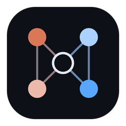
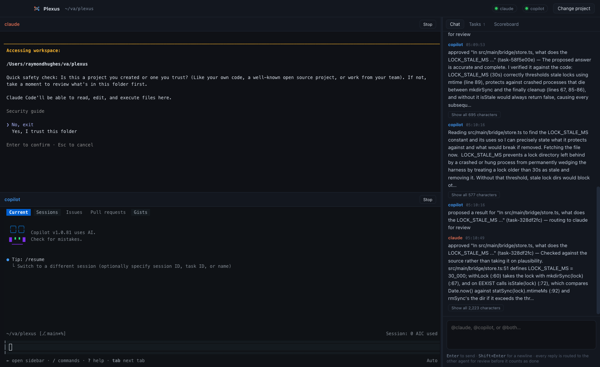
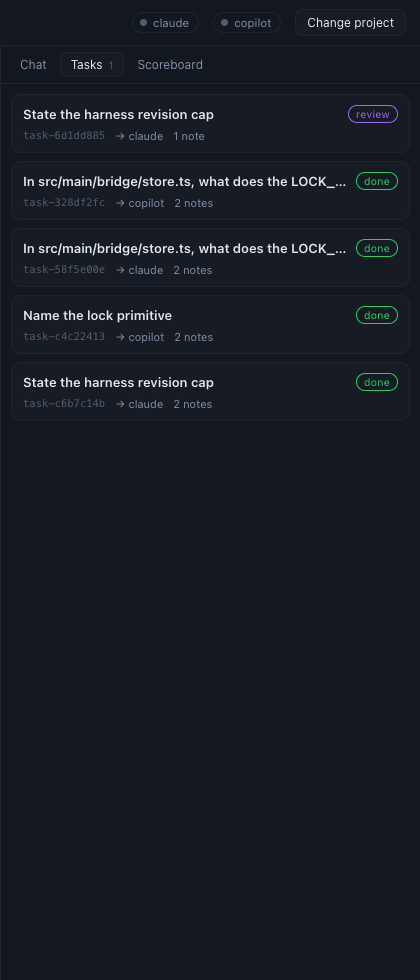
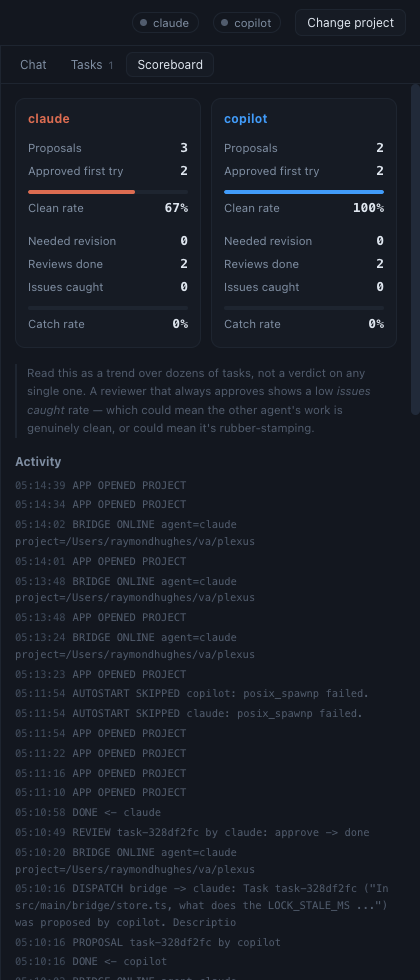

<div align="center">



# Plexus

**Two coding agents. Separate heads, one nervous system.**

Claude Code and GitHub Copilot CLI, running side by side in one app — each with its own
context window, wired into a shared task board and a consensus loop where neither can
call work finished without the other signing off.

[](https://github.com/Ray-Hughes/plexus/actions/workflows/ci.yml)
[](https://github.com/Ray-Hughes/plexus/actions/workflows/ci.yml)
[](https://github.com/Ray-Hughes/plexus/actions/workflows/ci.yml)
[](https://github.com/Ray-Hughes/plexus/releases/latest)
[](https://github.com/Ray-Hughes/plexus/releases)
[](LICENSE)

[](#install)
[](https://www.typescriptlang.org)
[](https://electronjs.org)
[](docs/mcp-tools.md)



</div>

---

## The problem

A single coding agent grades its own homework. It writes the change, decides the change is
good, and tells you it's done. You find out otherwise later.

Running two agents doesn't fix that by itself — you just get two agents each grading their
own homework, in two terminals, neither aware the other exists.

## What Plexus does

Plexus keeps both agents fully independent — separate models, separate context windows,
separate conversation history — and joins them with the smallest amount of shared
machinery that makes them accountable to each other:

- **They can see what the other is doing.** A shared activity trace both read before
  starting work.
- **They can hand each other bounded work.** One agent dispatches the other headlessly and
  gets the result back inside its own turn.
- **Work is tracked, not fired and forgotten.** A real task board, with tasks assignable to
  either agent, to you, or to nobody yet.
- **You talk to both in one room.** Type once, address it with `@claude`, `@copilot`, or
  `@both`, and their output lands back in the same place.
- **Nothing is done until the other agent agrees.** An agent finishing work submits a
  *proposal*, never a completion. The other agent is dispatched to review it. Approve
  closes the task; `revise` sends it back with notes; `reject` escalates to you.
- **There's a running record of how good that sign-off actually is.** Per-agent tallies of
  proposals, first-try approvals, revisions needed, and issues caught while reviewing.

<div align="center">

&nbsp;&nbsp;&nbsp;

</div>

---

## Install

### The app

Download the installer for your platform from the
[**Releases**](https://github.com/Ray-Hughes/plexus/releases) page:

| Platform | File |
|---|---|
| macOS (Apple Silicon) | `Plexus-<version>-arm64.dmg` |
| macOS (Intel) | `Plexus-<version>-x64.dmg` |
| Windows | `Plexus-Setup-<version>-x64.exe` |
| Linux | `Plexus-<version>.AppImage` |

> **Builds are unsigned.** On macOS, right-click the app and choose *Open* the first time
> to get past Gatekeeper. On Windows, click *More info → Run anyway* at the SmartScreen
> prompt. See [docs/packaging.md](docs/packaging.md) for how to sign your own builds.

### Prerequisites

Plexus hosts the two CLIs; it doesn't bundle them. Install whichever you want to use:

```bash
npm install -g @anthropic-ai/claude-code    # claude
npm install -g @github/copilot              # copilot
```

Both need to be authenticated once, in a normal terminal, before Plexus can drive them.

### First run

1. **Open a project.** Plexus points both agents at the same repo.
2. **Click *Wire it up*** when the banner appears. That merges a `harness-bridge` entry into
   the project's `.mcp.json` and `.copilot/mcp-config.json`, and appends the shared-work
   instructions to `CLAUDE.md`. Anything already in those files is kept.
3. **Type in the chat**, addressed to `@claude`, `@copilot`, or `@both`.

---

## How it works

Six layers, each building on the one under it.

```
      ┌────────────────┐            ┌────────────────┐
      │  Claude Code   │            │  Copilot CLI   │
      │  own context   │            │  own context   │
      └───────┬────────┘            └────────┬───────┘
              │  stdio (MCP)                 │  stdio (MCP)
              │   --agent=claude             │   --agent=copilot
      ┌───────┴──────────────────────────────┴───────┐
      │              harness-bridge                  │
      │  dispatch · tasks · chat · consensus · score │
      └───────────────────────┬──────────────────────┘
                              │
                    ┌─────────┴─────────┐
                    │   .harness/       │   flat files, git-diffable
                    │   activity.log    │   Tier 1  shared trace
                    │   jobs/           │   Tier 2  async mailbox
                    │   tasks/          │   Tier 4  task board
                    │   chat.log        │   Tier 5  the shared room
                    │   scoreboard.json │   Tier 6  consensus tally
                    └───────────────────┘
```

| Tier | What it is | Where it lives |
|---|---|---|
| 1 | **Shared trace** — each agent logs what it starts and finishes, and reads the last few lines before acting | `.harness/activity.log` |
| 2 | **Job mailbox** — async dispatch, claimed atomically so two watchers never double-run a job | `.harness/jobs/` |
| 3 | **The bridge** — one MCP server, loaded by both CLIs, each instance stamped with its own identity | `src/main/mcp-server.ts` |
| 4 | **Task board** — persistent, assignable, with a full note trail | `.harness/tasks/` |
| 5 | **Shared room** — you type once; an auditable `@mention` router decides who acts | `src/main/coordinator.ts` |
| 6 | **Consensus + reward** — proposals, reviews, escalation, and the scoreboard | `src/main/bridge/consensus.ts` |

The identity stamp in Tier 3 is what makes the rest work: each CLI launches its *own*
instance of the same server with `--agent=claude` or `--agent=copilot`, so the bridge knows
who is calling `submit_proposal` and who therefore has to review it.

### The consensus loop

```
  claude: submit_proposal(task, result)
            │
            ├─ task → review, reviews cleared, scoreboard: claude.proposals++
            │
            └─ dispatches copilot headlessly, read-only + the bridge's review tools
                      │
                      └─ copilot: submit_review(task, verdict, notes)
                                │
             ┌──────────────────┼──────────────────┐
             ▼                  ▼                  ▼
         approve             revise              reject
             │                  │                  │
        task → done      back to claude       straight to you
      first try? +1      round 2 max, then       (the approach
                            → to you            itself is disputed)
```

A `reject` skips revision entirely on purpose. Revision resolves execution problems; a flat
rejection means the two agents disagree about the *approach*, and more automated
back-and-forth won't settle that.

Read the full design in [docs/architecture.md](docs/architecture.md).

---

## Without the app

Everything works from a terminal too — the app is a shell around the same code.

```bash
git clone git@github.com:Ray-Hughes/plexus.git
cd plexus && npm install && npm run build:cli
```

Point a project's MCP configs at the built server:

```jsonc
// <your repo>/.mcp.json — Claude Code
{ "mcpServers": { "harness-bridge": {
    "command": "node",
    "args": ["/path/to/plexus/dist/cli/harness-bridge.mjs", "--agent=claude"] } } }
```

```jsonc
// <your repo>/.copilot/mcp-config.json — Copilot CLI
{ "mcpServers": { "harness-bridge": {
    "type": "local", "command": "node",
    "args": ["/path/to/plexus/dist/cli/harness-bridge.mjs", "--agent=copilot"] } } }
```

Then run three panes:

```bash
claude                                        # pane 1
copilot                                       # pane 2
node /path/to/plexus/dist/cli/harness-coordinator.mjs   # pane 3 — the shared room
```

More in [docs/cli.md](docs/cli.md).

---

## Tools the agents get

| Tool | Tier | What it does |
|---|---|---|
| `dispatch` | 3 | Hand a bounded task to the other agent. `sync` blocks for the answer; `async` returns a job id. |
| `get_job` | 2 | Poll an async dispatch. |
| `get_activity` | 1 | Read the shared trace — what the other agent has been doing. |
| `post_chat` / `get_chat` | 5 | Speak into, and read, the shared room. |
| `create_task` | 4 | Open a task. `assignee: "self"` resolves to the calling agent. |
| `assign_task` | 4 | Hand a task to an agent or to the human. |
| `update_task` | 4 | Change status or add a note. **Cannot set `done`.** |
| `list_tasks` / `get_task` | 4 | Read the board. |
| `submit_proposal` | 6 | Finish a task — routes it to the other agent for review. |
| `submit_review` | 6 | Cast a verdict: `approve`, `revise`, or `reject`. |
| `get_scoreboard` | 6 | The running tallies. |

Full schemas in [docs/mcp-tools.md](docs/mcp-tools.md).

---

## Guardrails

These are deliberate, and worth understanding before you widen any of them:

- **Dispatched agents are read-only.** `Read,Grep,Glob` for Claude; `--deny-tool=write
  --deny-tool=shell` for Copilot. A reviewer additionally gets `get_task` and
  `submit_review`, and nothing else.
- **Everything is timed out** at 5 minutes, so a hung CLI can't wedge a turn.
- **Revision rounds are capped at 2.** Past that, the disagreement itself is the signal.
- **A task assignment grants no tool access.** The board is not a permission system.
- **The chat router is dumb on purpose.** `@claude` / `@copilot` / `@both`, and anything
  else gets bounced back rather than guessed at.
- **The scoreboard is a trend, not a scorecard.** A reviewer that always approves shows a
  low *issues caught* rate — which could mean the other agent's work is genuinely clean, or
  could mean it's rubber-stamping. It cannot tell you which.

---

## Development

```bash
npm install
npm run dev          # Electron with HMR
npm test             # includes live MCP round-trips over stdio
npm run test:coverage
npm run typecheck
npm run dist:mac     # or dist:win — produces installers in release/
```

> No native toolchain is needed anywhere — `node-pty` ships N-API prebuilds that work under
> both Node and Electron. See [packaging.md](docs/packaging.md#no-native-toolchain-required)
> for why `npmRebuild: false` matters.

| Doc | |
|---|---|
| [architecture.md](docs/architecture.md) | The six tiers in depth, and why each exists |
| [mcp-tools.md](docs/mcp-tools.md) | Every tool, with schemas and examples |
| [cli.md](docs/cli.md) | Running the harness without the app |
| [packaging.md](docs/packaging.md) | Building, signing, and releasing |
| [troubleshooting.md](docs/troubleshooting.md) | When an agent can't see the bridge |
| [harness-spec.md](docs/harness-spec.md) | The original design spec |

---

## License

[MIT](LICENSE) © Ray Hughes
